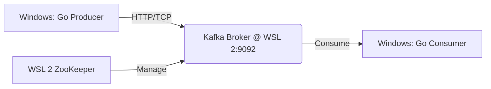

```markdown
# Go Kafka Event Streaming Pipeline

A real-time event streaming application built with **Go (Golang)** and **Apache Kafka**. This project demonstrates a producer-consumer pattern handling financial transaction data, running in a hybrid **Windows (Host) + WSL 2 (Broker)** environment.

## 🚀 Features

- **Real-time Event Streaming:** Producers send financial transaction events; consumers process them instantly.
- **Hybrid Environment:** Kafka broker runs inside **WSL 2**, while Go applications run natively on **Windows**.
- **Network Bridging:** Successfully configured `advertised.listeners` to allow seamless cross-platform communication.
- **Concurrency:** Leverages Go's goroutines for high-throughput message handling.
- **Modular Design:** Separate modules for `Producer` and `Consumer` logic.

## 🏗 Architecture



- **Producer:** `the_producer.go` - Sends JSON transaction events to the `financial-transactions` topic.
- **Consumer:** `the_consumer.go` - Subscribes to the topic and logs processed events.
- **Broker:** Apache Kafka 3.9.0 (running in WSL 2).
- **Topic:** `financial-transactions` (Partition: 1, Replication: 1).

## 🛠 Prerequisites

Before running this project, ensure you have the following installed:

1.  **Go (Golang):** [Download & Install](https://go.dev/dl/) (v1.20+ recommended)
2.  **WSL 2 (Windows Subsystem for Linux):** Ensure a Linux distro (e.g., Ubuntu) is installed.
3.  **Apache Kafka:** Downloaded and extracted inside WSL 2.
4.  **Git:** For version control.

## 📦 Installation & Setup

### 1. Initialize the Go Module
If you haven't already, initialize the module and install dependencies:

```bash
# In your project directory (Windows PowerShell or CMD)
go mod init go_lang
go get github.com/segmentio/kafka-go
```

### 2. Set Up Kafka in WSL 2

#### A. Start ZooKeeper
Open your WSL terminal and navigate to your Kafka directory:

```bash
cd ~/kafka_2.13-3.9.0  # Adjust path as needed
bin/zookeeper-server-start.sh config/zookeeper.properties
```
*Keep this terminal open.*

#### B. Configure Kafka for WSL 2 (Crucial Step)
To allow Windows apps to connect to the WSL broker, you must edit the `server.properties` file.

1.  Open the config file:
    ```bash
    nano config/server.properties
    ```
2.  Find or add the `advertised.listeners` line and set it to:
    ```properties
    advertised.listeners=PLAINTEXT://localhost:9092
    ```
    *(This ensures the broker advertises `localhost` to Windows clients, bridging the WSL network layer).*
3.  Save and exit (`Ctrl+O`, `Enter`, `Ctrl+X`).

#### C. Start Kafka
Open a **new** WSL terminal:

```bash
bin/kafka-server-start.sh config/server.properties
```
*Wait for the log: `[KafkaServer id=0] started`.*

#### D. Create the Topic
Before running the producer, create the required topic:

```bash
bin/kafka-topics.sh --create --topic financial-transactions --bootstrap-server localhost:9092 --partitions 1 --replication-factor 1
```

## ▶️ Usage

### 1. Start the Consumer
Open a **Windows PowerShell** terminal and run the consumer first to ensure it's listening:

```powershell
go run the_consumer.go
```

**Expected Output:**
```text
AuraStream Processor started. Awaiting Kafka events...
```

### 2. Start the Producer
In a **new Windows PowerShell** terminal, run the producer:

```powershell
go run the_producer.go
```

**Expected Output:**
```text
Transaction event successfully streamed to Kafka!
```

### 3. Verify Processing
Check the **Consumer** terminal window. You should see the processed event:

```text
Processed Stream Event: Topic=financial-transactions | Partition=0 | Offset=0 | Data={"transaction_id": "tx_98765", "amount": 5400.50, "currency": "USD"}
```

## 🧪 Testing Connectivity

If you encounter connection issues, verify the link between Windows and WSL:

1.  **Check Port:**
    ```powershell
    Test-NetConnection -ComputerName localhost -Port 9092
    ```
    *Ensure `TcpTestSucceeded` is `True`.*

2.  **Check Kafka Logs:**
    In the WSL terminal running Kafka, ensure there are no `Connection refused` or `Unknown Topic` errors.

## 📝 Project Structure

```text
go_lang/
├── the_producer.go      # Producer logic
├── the_consumer.go      # Consumer logic
├── go.mod               # Go module definition
├── go.sum               # Dependency checksums
└── README.md            # This file
```

## 🤝 Contributing

Contributions are welcome! Feel free to submit issues or pull requests to improve the code or documentation.

## 📄 License

This project is open source and available under the MIT License.

---

**Built with ❤️ using Go & Apache Kafka on Windows/WSL 2.**
```

### How to use this:
1.  Copy the code block above.
2.  Create a new file named `README.md` in your `D:\Projects\go_lang` folder.
3.  Paste the content and save.
4.  (Optional) Replace `~/kafka_2.13-3.9.0` in the "Set Up Kafka" section with your actual WSL path if it differs.

This README clearly documents the "gotcha" you solved (the WSL networking config), which is a great talking point for your portfolio or GitHub profile!
